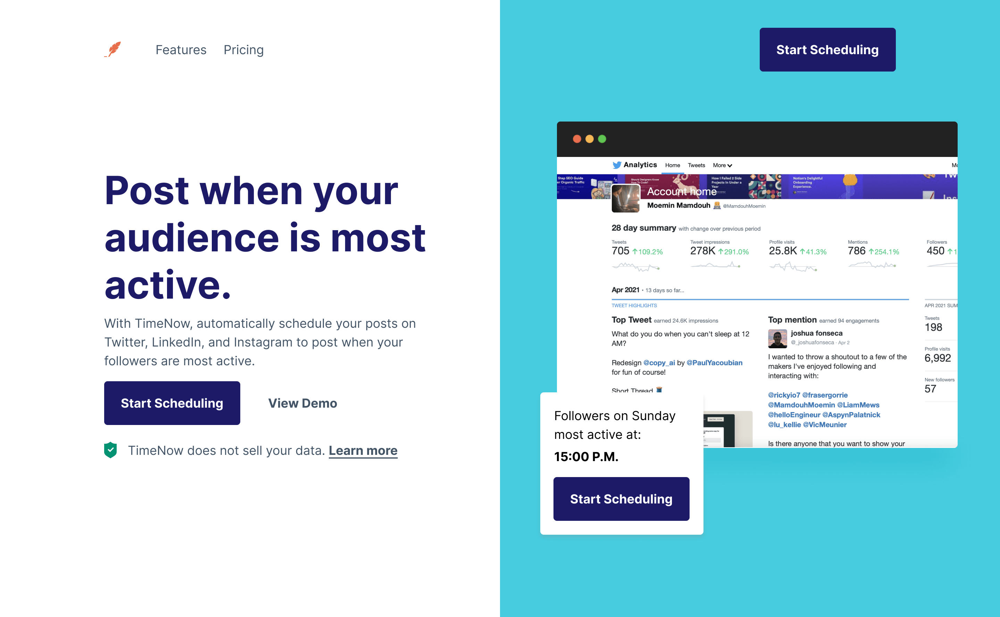

# Meu Projeto Codewell 👋

Este é um projeto pessoal que desenvolvi para aprimorar minhas habilidades em HTML e CSS. Utilizei templates de alta qualidade fornecidos pelo Codewell, que se tornaram excelentes peças para o meu portfólio

## 🎯 Objetivo do Projeto

O objetivo deste projeto é praticar e aprimorar minhas habilidades em HTML e CSS, utilizando templates do mundo real como referência.

## 💡 Processo de Desenvolvimento

Durante o desenvolvimento deste projeto, enfrentei vários desafios que me ajudaram a crescer como desenvolvedor. Compartilhei minha experiência e os obstáculos que enfrentei no repositório do Github.

## 🎨 Design

O design do projeto foi inspirado pelos templates do Codewell. As fontes utilizadas podem ser encontradas em Google Fonts.
